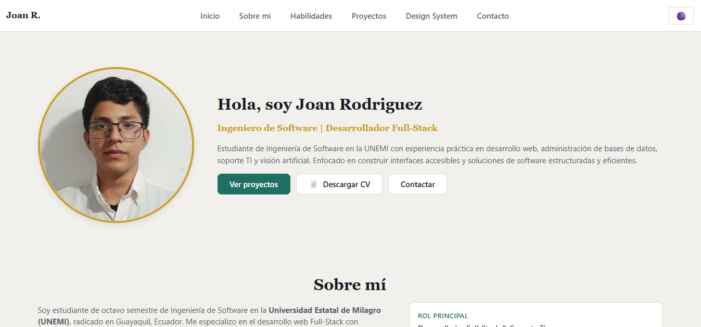
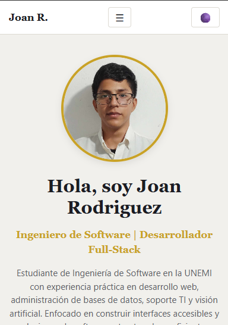
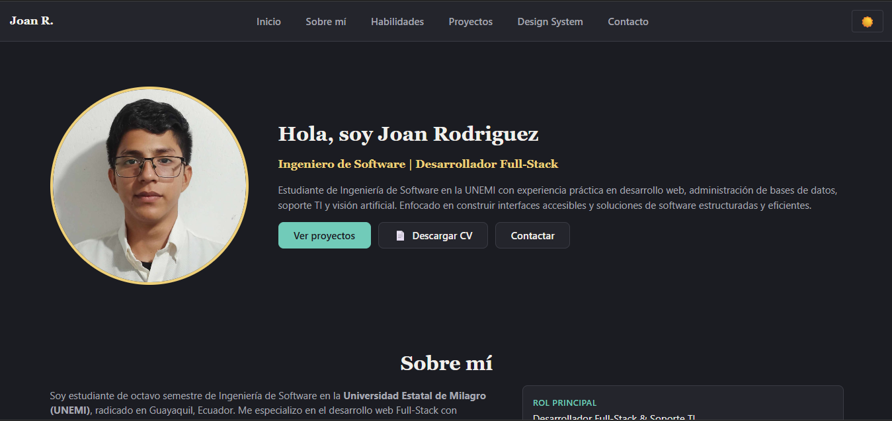
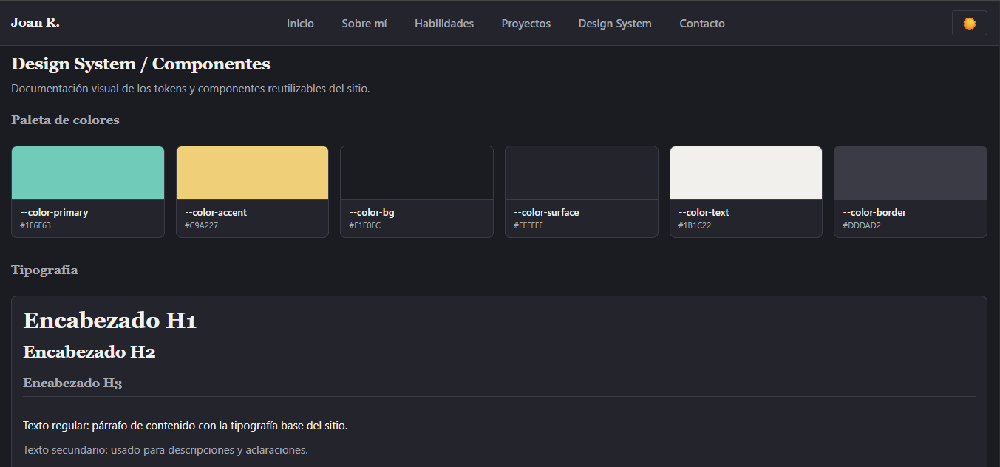

# Portafolio Web Personal

Portafolio personal e interactivo que presenta mis proyectos destacados, habilidades técnicas y perfil profesional. Está construido con un enfoque **Mobile-First**, un **sistema de diseño propio** y buenas prácticas de accesibilidad, para ofrecer una experiencia consistente en móviles, tablets y escritorio.

## Tecnologías utilizadas

- **HTML5 Semántico**: estructura con `header`, `main`, `section`, `article`, `aside` y `footer`, más atributos ARIA para accesibilidad.
- **CSS3**: Custom Properties (`:root`), arquitectura Mobile-First, Flexbox y CSS Grid.
- **Vanilla JavaScript (ES6+)**: sin frameworks ni librerías externas.


## Características principales

- **Design System propio**: tokens de color, tipografía, espaciado, bordes, sombras y transiciones, con una sección que documenta visualmente cada componente.
- **Tema claro / oscuro** con persistencia en `localStorage` y respeto de la preferencia del sistema (`prefers-color-scheme`).
- **Animaciones con Intersection Observer** para revelar elementos al hacer scroll.
- **Menú móvil responsivo** con estados accesibles (`aria-expanded`) y cierre automático al navegar.
- **Validación de formularios** en el formulario de contacto, con mensajes de error accesibles.
- **Diseño responsivo** con CSS Grid fluido y componentes reutilizables (botones, tarjetas, etiquetas de habilidades).
- **Botón "Volver arriba"** con desplazamiento suave.


## Instrucciones de visualización

1. Clona el repositorio:
  ```bash
   git clone https://github.com/usuario/nombre-del-repositorio.git
  ```
2. Entra en la carpeta del proyecto:
  ```bash
   cd nombre-del-repositorio
  ```
3. Abre el proyecto en tu editor (por ejemplo, Visual Studio Code).
4. Inicia el sitio con la extensión **Live Server**: clic derecho sobre `index.html` y selecciona **Open with Live Server**.

También puedes abrir `index.html` directamente en tu navegador.

## Despliegue

El proyecto está publicado en GitHub Pages:

🔗 **[https://joanxd26.github.io/Portafolio-Personal/](https://joanxd26.github.io/Portafolio-Personal/)**

## Capturas del resultado


### Vista de escritorio



### Vista móvil



### Modo oscuro



### Design System

